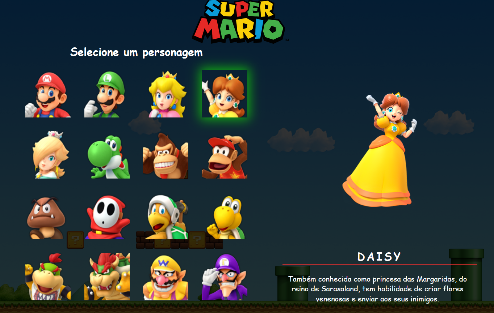

<h1 align="center"> Projeto Mario Bros </h1>

Projeto realizado por William Ramos, pelas dicas e segmentos do Dev em Dobro.  

  <a href="#-tecnologias">Tecnologias</a>&nbsp;&nbsp;&nbsp;|&nbsp;&nbsp;&nbsp;
  <a href="#-projeto">Projeto</a>&nbsp;&nbsp;&nbsp;|&nbsp;&nbsp;&nbsp;
  <a href="#-layout">Layout</a>&nbsp;&nbsp;&nbsp;|&nbsp;&nbsp;&nbsp;
  <a href="#memo-licença">Licença</a>

  

 

  

## 🚀 Tecnologias

Esse projeto foi desenvolvido com as seguintes tecnologias:

- HTML e CSS
- JavaScript
- Git e Github

## 💻 Projeto

O MarioBros Project é um design de site para entrada e escolha de personagens, como se fosse um prologo de alguma batalha ou inicio de aventura de gameplay, nele você pode alterar os personagens e ler sua história e habilidades.

## 🔖 Layout

Você pode visualizar o layout do projeto Original através deste link:

https://github.com/devemdobro/x-men-szpc

Feito com ♥ by William.
